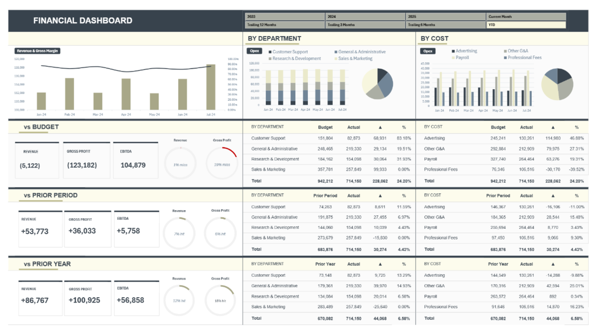

# Financial Performance Dashboard

**A one-click FP&A reporting dashboard built in Excel with Power Query, Power Pivot, and DAX.** Change a single date cell, hit *Refresh All*, and every KPI, variance, and chart updates — Revenue, Gross Profit, and EBITDA against budget, prior period, and prior year, with operating spend broken down by department and cost type.

---

## Why this project

Most finance teams hand stakeholders a raw P&L export. This project turns that same data into an interactive executive dashboard that answers the three questions leadership actually asks every month — *How did we do versus budget? Versus last period? Versus last year?* — and lets the user re-slice the whole view from a single input cell.

## Skills demonstrated

| Area | What it shows |
|------|---------------|
| **Data modeling** | A star-schema in the Power Pivot data model: two fact tables (actuals + budget) related to date, account, and department lookup tables. |
| **ETL / data wrangling** | Power Query unpivots eight human-readable monthly grids into tidy tables and appends them into single fact tables — repeatable on refresh. |
| **DAX & time intelligence** | Period measures (current month, trailing 3 / 6 / 12, YTD) with matched prior-period and prior-year comparisons, driven by a `SWITCH`-based selector. |
| **FP&A / financial analysis** | Budget-vs-Actual variance analysis, gross-margin bridges, and operating-expense decomposition by department and cost type. |
| **Dashboard design** | KPI tiles, conditional green/red donut gauges, and slicer-driven interactivity — one click re-points the entire report. |
| **Business storytelling** | Translating variances into CFO-level findings and prioritized recommendations (see the companion documentation). |

## Sample insights it surfaces

*From the included sample dataset (trailing 12 months) — illustrative of the read-outs the dashboard produces:*

- **Revenue on plan, margin off plan.** Revenue landed within ~1% of budget and grew +12% YoY, yet gross margin compressed ~15 points — isolating the problem to cost of goods, not sales.
- **Cost discipline cushioned the loss.** Operating expenses came in 24% under budget, turning a budgeted EBITDA loss of $(159k) into $(54k).
- **One line ran hot.** Professional Fees was the only over-budget category (+40%) against universal under-spend elsewhere — exactly the kind of exception a dashboard should flag.

## How it's built

The Dashboard reads only from the measures — never the raw tabs — so the presentation layer stays insulated from the underlying data. The single `Current Month` input cell drives every reporting window.

**Full build, architecture, and maintenance guide:** [`docs/TECHNICAL.md`](docs/TECHNICAL.md)
**CFO-style findings & recommendations memo:** [`Financial_Performance_Dashboard_Documentation.pdf`](docs/Financial_Performance_Dashboard_Documentation.pdf) (opens in GitHub's viewer; an editable `.docx` is in the repo too)

## What's in the repo

| File | Purpose |
|------|---------|
| `Financial_Performance_Dashboard.xlsx` | The workbook — model, data model, and dashboard. |
| `README.md` | This overview. |
| `docs/TECHNICAL.md` | Deep-dive documentation (architecture, data model, measures, usage). |
| `Financial_Performance_Dashboard_Documentation.pdf` | Formatted documentation + findings memo (previews in-browser on GitHub). |
| `Financial_Performance_Dashboard_Documentation.docx` | Editable Word version of the documentation. |
| `LICENSE` | MIT license. |

## Run it

- Requires **Microsoft Excel on Windows or Microsoft 365** (Power Pivot is needed; it is **not** available on Excel for Mac).
- Open `Financial_Performance_Dashboard.xlsx`, change the `Current Month` cell on the `List` sheet, and choose a window on the Period slicer. Use *Data → Refresh All* after editing data.

## About this project

This dashboard was built as a hands-on FP&A and Excel data-modeling exercise, following a step-by-step tutorial on the Power Query → Power Pivot → DAX workflow. I rebuilt it end to end to understand each layer — the ETL, the relationships, the time-intelligence measures, and the variance logic — and I'm happy to walk through any part of how it works.

## License

Released under the [MIT License](LICENSE) — free to use, modify, and distribute with attribution. Set the copyright holder in `LICENSE` before publishing.

## Disclaimer

The included figures are driver-generated sample data, not audited financials. Validate assumptions and load your own data before relying on outputs for decisions.
